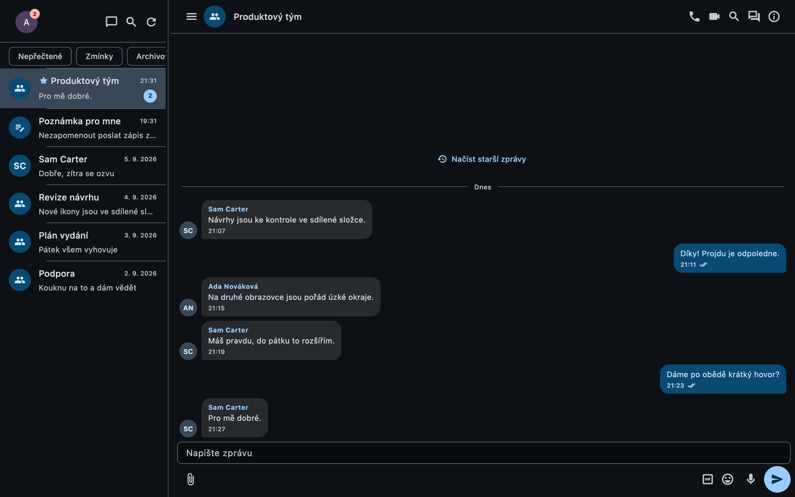
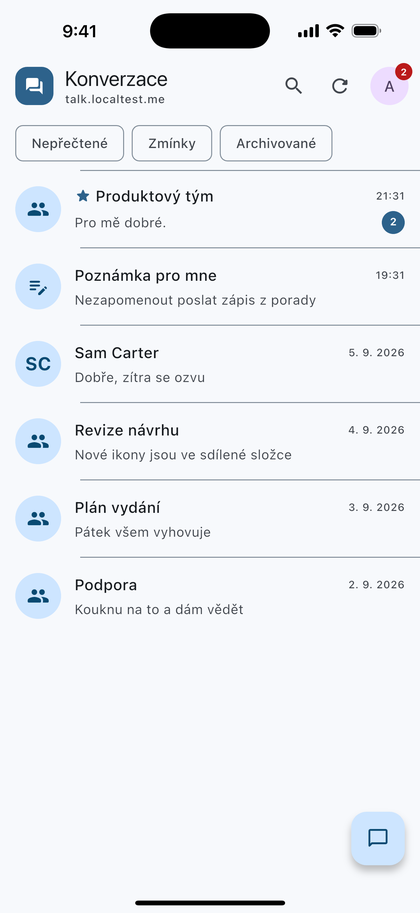
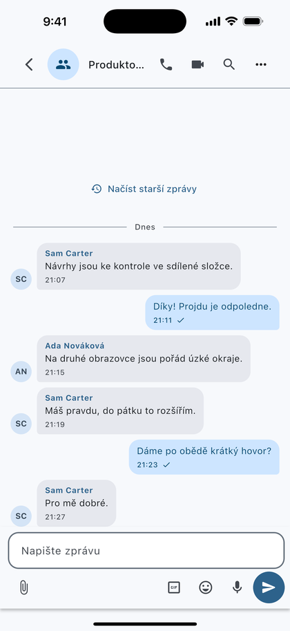
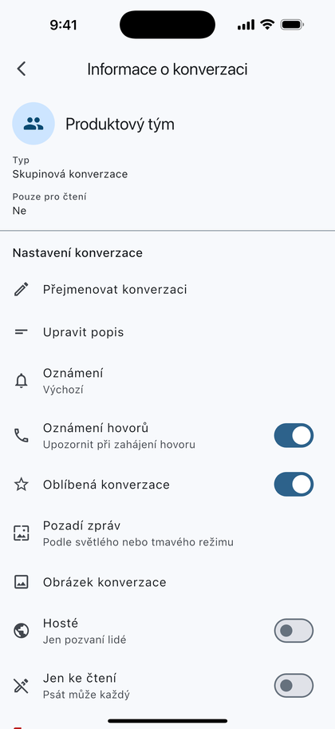
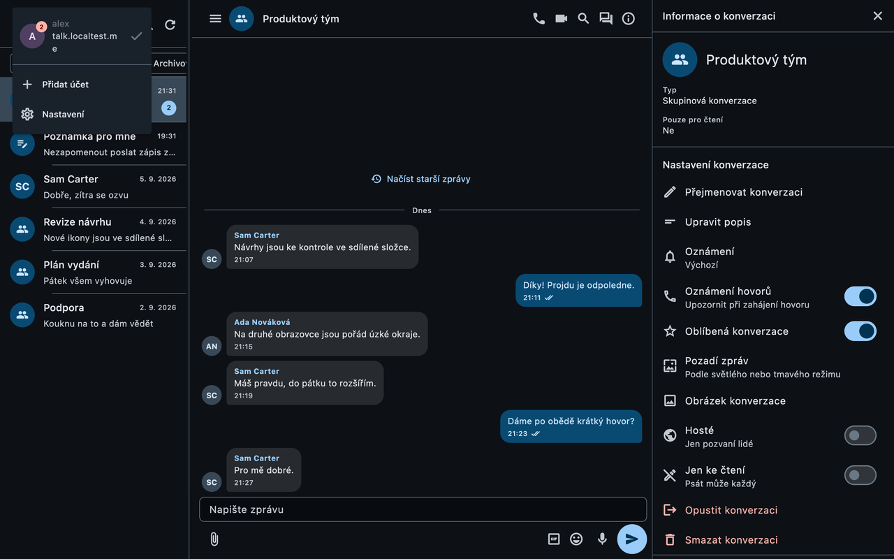

# OwnTalk

OwnTalk is a chat and calling app for Nextcloud Talk. It runs on Android, iOS, Windows, macOS and Linux from one Flutter codebase, and one install can be signed in to several accounts on several Nextcloud servers at the same time.

It is an independent client, not an app from Nextcloud GmbH. Until version 1.0.13 it was called NKS Talk. Only the name changed: package ids, data folders and settings stayed where they were, so an update keeps every account and conversation.

The code is ours and licensed under [`GPL-3.0-or-later`](LICENSE). The official Android and iOS apps are the reference we compare behaviour against, not a template for the UI. The Czech emoji names in `apps/mobile/lib/features/chat/composer/emoji_czech_names.g.dart` come from the Unicode CLDR annotations and fall under the [Unicode license](https://www.unicode.org/license.txt).



<p>
  
  
  
</p>



The people, rooms and server in these pictures are invented. They come from `tool/store_screenshot_server.py`, a stand-in Talk server used only for screenshots, so no real account ever appears in them.

## Where to get it

Android builds go to Google Play closed testing; testers opt in at <https://play.google.com/apps/testing/com.nkshub.nextcloudtalk>. Production access on Google Play was requested on 24 September 2026 and is waiting for Google's review.

iOS builds go to TestFlight, by invitation.

Windows, macOS and Linux builds are attached to each tagged [release](https://github.com/nks-hub/nks-nextcloud-talk/releases). The macOS app is signed with a Developer ID and notarized by Apple. The Windows installer is not code-signed, so SmartScreen warns once on the first run. The desktop app checks the releases page for a newer build and can install it itself.

The server needs Talk 22 (Nextcloud 32) or newer.

## What works today

Chat covers what a Talk room offers: replies, threads, reactions, mentions with suggestions, editing and deleting, pinned messages, reminders, silent and scheduled sending. Messages render Markdown, and the composer has a formatting menu for bold, italic, strikethrough, inline code and code blocks.

You can attach photos and files, record voice messages, and send polls, your location, contacts and GIFs. A paste longer than the 32,000 characters a message can hold is sent as a `.md` or `.txt` file instead of being cut short.

Calls work with audio and video, in groups, with screen sharing, over the Talk high-performance backend or Talk's internal signalling, and through TURN when a direct path fails.

On Android and iOS a notification arrives even when the app is closed. On Windows, macOS and Linux it arrives only while the app runs; the app can start when you sign in and keep running in the tray.

The conversation list and the history load from a local database first and then update from the server. A message written without a connection waits in an ordered outbox and goes out when the connection returns.

Phones get a single-pane layout, tablets and desktops a two- or three-pane one. On a desktop the app can be driven by keyboard. It has an app lock with biometrics, Czech and English, light and dark themes, and it is tested with large text and screen readers.

## Building

The app is in [`apps/mobile`](apps/mobile). The Talk wire models it uses live in the pure Dart package [`talk_protocol`](packages/talk_protocol).

Windows builds need a JDK and `JAVA_HOME`, even though Android is not involved: `sentry_flutter` depends on the `jni` package, which registers itself as an FFI plugin on Windows too. Without a JDK its `find_package(JNI)` stops CMake with a `FindJNI.cmake` error that never mentions Java.

Linux builds need the same JDK and four packages that Flutter's own list leaves out. On a clean Linux Mint installation (3 September 2026) the build failed on each of them in turn: `libgstreamer1.0-dev` and `libgstreamer-plugins-base1.0-dev` for `audioplayers_linux`, `libcurl4-openssl-dev` for sentry-native, and `default-jdk-headless` for `jni`. After a failed configure, CMake keeps `CMAKE_INSTALL_PREFIX=/usr/local` in its cache and the next attempt fails with `Permission denied` during install. `flutter clean` fixes it; editing `linux/CMakeLists.txt` does not.

## Tests

On 24 September 2026 `flutter analyze` reported no findings and `apps/mobile` passed 2,761 tests with 7 skipped.

```sh
cd apps/mobile
flutter analyze
flutter test
cd ../../packages/talk_protocol
dart test
```

Run `talk_protocol` with `dart test`, not `flutter test`. Seven of its tests compile a probe through `Platform.resolvedExecutable … compile exe`. Under `flutter test` that executable is the Flutter tester instead of the Dart VM, the compilation never returns, and all seven time out after 30 seconds. The suite then looks broken when only the runner is wrong.

Some of the skipped tests are live checks against a real Nextcloud. They run when `NEXTCLOUD_TALK_ORIGIN`, `NEXTCLOUD_TALK_USERNAME` and `NEXTCLOUD_TALK_APP_PASSWORD` are set. The room-scoped search also needs `NEXTCLOUD_TALK_TEST_ROOM_TOKEN` pointing at a conversation with messages; in an empty room its assertion passes without proving anything. `NEXTCLOUD_TALK_SEARCH_TERM` changes the search term, which defaults to `a`.

`apps/mobile/integration_test/desktop_composer_keys_test.dart` drives the real Windows app with keys sent through `SendInput`, because `tester.sendKeyEvent` bypasses the part of the engine where keyboard bugs live. Run it with `NKS_TALK_INTEGRATION_TEST=1`. It refuses to send a key unless the test window is in the foreground, since `SendInput` types into whatever window is in front.

The macOS native suite (17 tests, last run 7 September 2026) needs Apple Development signing. macOS refuses an ad-hoc signature on an app with APNs and shared-keychain entitlements before any test starts. With your team's values in `APPLE_TEAM_ID`, `ASC_KEY_PATH`, `ASC_KEY_ID` and `ASC_ISSUER_ID`, run from `apps/mobile`:

```sh
xcodebuild test -workspace macos/Runner.xcworkspace -scheme Runner \
  -destination 'platform=macOS' -parallel-testing-enabled NO \
  CODE_SIGN_IDENTITY='Apple Development' \
  APPLE_TEAM_ID="$APPLE_TEAM_ID" DEVELOPMENT_TEAM="$APPLE_TEAM_ID" \
  -allowProvisioningUpdates -allowProvisioningDeviceRegistration \
  -authenticationKeyPath "$ASC_KEY_PATH" \
  -authenticationKeyID "$ASC_KEY_ID" \
  -authenticationKeyIssuerID "$ASC_ISSUER_ID"
```

The provisioning flags register the Mac and create development profiles when needed; an Xcode account with existing profiles can replace the API arguments. The command only runs tests and publishes nothing.

`gh workflow run build.yml --ref main -f tests_only=true` runs the CI checks without building packages. A manual run without that flag builds Android, Linux and Windows. Publishing happens only for release tags, and Apple builds are made on a Mac, not in CI.

## How notifications reach a phone

Android and iOS register Nextcloud push v2 against our own gateway, [`nks-talk-notify`](https://github.com/nks-hub/nks-talk-notify), which sends through FCM v1 and APNs (decision D-038, in place since 27 August 2026). The client picks the gateway address when it registers the device, so nobody has to rebuild the app per server. The gateway only accepts deliveries from servers whose subscription key it knows, so a Nextcloud administrator sets `subscription_aware_server` to the gateway once; its README explains that step. The Firebase configuration, `google-services.json`, is kept out of the repository.

Nextcloud 34 and newer can also deliver through Web Push, over the UnifiedPush connector and an embedded FCM distributor. It is a fallback you can switch to in Settings → Push notifications without a new build, and the only path that needs neither our Firebase project nor our gateway: the VAPID key and the subscription are negotiated with each server at runtime.

While the app runs, every platform also listens on Nextcloud Client Push (`notify_push`), a websocket the server advertises in its capabilities. That is what delivers messages instantly on the desktop.

iOS cannot do without a gateway. Nextcloud does not talk to APNs; `apps/notifications/lib/Push.php` only posts notifications to the proxy address stored with each device. The official Talk app uses `push-notifications.nextcloud.com`, which signs with Nextcloud GmbH's Apple certificate for their bundle id, so nothing a third-party app sends gets through it. That address is not part of a self-hosted Nextcloud and cannot be set in its administration; the client supplies its own through the `proxyServer` parameter when it registers.

The [notifications document](docs/architecture/notifications.md) describes all three channels, the contract with Nextcloud, and what each platform fixes in place.

## Documentation

- [Documentation index](docs/README.md)
- [Flutter application foundation](docs/architecture/flutter-foundation.md)
- [System design](docs/architecture/system-design.md)
- [Notifications on all platforms](docs/architecture/notifications.md)
- [Decisions and open choices](docs/architecture/decisions.md)

## Contributing

Read [CONTRIBUTING.md](CONTRIBUTING.md) first, especially the public repository policy: nothing that names the operator's hosts, machines, accounts or identifiers goes into this repository.
